# ✋ OpenCV Hand Tracking & Finger Counting (Webcam)

This project uses **classical computer vision** (no deep learning) to perform:

- Real-time **hand tracking**
- **Skin-based segmentation** inside a Region of Interest (ROI)
- **Contour + convex hull** extraction
- **Convexity defects** analysis to estimate **number of extended fingers**

Input: Webcam  
Output: Live view with:
- ROI box
- Hand contour + convex hull
- Marked finger gaps
- `Fingers: N` overlay

---

## 🎯 What this repo demonstrates

- Using webcam frames as a **real-time CV input**
- Skin detection in **YCrCb color space**
- Extracting the **largest contour** as the hand
- Computing **convex hull** of the hand
- Extracting **convexity defects** (valleys between fingers)
- Converting defects into **finger count** using geometry (angles + depth)
- Overlaying the result live + saving snapshots

---

## 📂 Project Structure

```text
opencv-hand-tracking-finger-count/
│
├── main.py          # Webcam hand tracking + finger counting
├── requirements.txt # Dependencies (opencv-python, numpy)
├── outputs/         # Saved annotated snapshots
└── README.md
```
## 🚀 How to Run

### 1️⃣ Install dependencies
```bash
pip install -r requirements.txt
```

### 2️⃣ Run the script
```bash
python main.py
```

### 3️⃣ Controls
- `q` → quit
- `s` → save current frame (annotated) into `outputs/`

Place your hand inside the yellow ROI box in the camera view.
Try:

- 0 fingers (fist)
``- 1, 2, 3, 4, 5 fingers

You’ll see the finger count update in real-time.

## 🔍 How It Works — Step-by-Step

### **1. Region of Interest (ROI)**
The system does **not** process the full webcam frame.  
Instead, it tracks only a fixed rectangular region where you place your hand.  
This reduces noise, improves segmentation, and boosts FPS.

---

### **2. Skin Detection (YCrCb Color Space)**

Inside the ROI:

- Convert **BGR → YCrCb**
- Apply skin thresholds:

```text
Cr: 133–173
Cb: 77–127
```

- Apply morphological operations (erode, dilate, blur) to clean up the mask

Result: binary skin mask where the hand appears as a large white region.

---


- Clean the binary mask using:
  - **Erosion**
  - **Dilation**
  - **Gaussian blur**

The result is a **white hand region** on a black background.

---

### **3. Contour Extraction**

From the cleaned skin mask:

1. Find **all contours**
2. Keep only the **largest contour** (assumed hand)
3. Draw:
   - **Yellow contour** → hand outline  
   - **Green hull** → convex hull shape  

If no valid contour is found → output **0 fingers**.

---

### **4. Convexity Defects → Finger Counting**

Using the largest contour:

1. Compute convex hull (indices)
2. Use `cv2.convexityDefects` to identify **valleys between fingers**
3. For each defect:
   - Compute triangle edges (**a**, **b**, **c**)
   - Use **cosine rule** to find the angle at the valley
   - Evaluate the **defect depth**

A defect is valid when:

- **Angle** is below a threshold (e.g., 80°)
- **Depth** is above a threshold (e.g., 20px)

Each valid defect corresponds to a **finger gap**.

👉 **Finger count = valid defects + 1**  
(Maximum clamped to **5 fingers** for stability.)

---

### **5. Overlay + Output**

Overlay the finger count on the frame and display it in real-time.

---

## 📌 Notes

- The finger count is **not** perfect.  
  It’s a simple heuristic based on convexity defects.
- The finger count is **not** perfect.  
  It’s a simple heuristic based on convexity defects.

---

## 🎨 On-Screen Visualization

The system overlays helpful visual cues to show *exactly* how the hand is being analyzed:

- **Yellow contour** → detected hand outline  
- **Green convex hull** → smoothed outer boundary  
- **Red markers** → convexity defect points (valleys between fingers)  
- **Text (top-left):**  
  - `Fingers: N` → finger count  
  - `FPS: N` → current FPS

---

### 📸 Outputs

Below are typical output frames generated by the system:
```text
outputs/
│
├── 2/
│   ├── image1-2.jpg
│   ├── image2-2.jpg
│   ├── image3-2.jpg
│   └── image4-2.jpg
├── 3/
│   ├── image1-3.jpg
│   ├── image2-3.jpg
│   ├── image3-3.jpg
│   └── image4-3.jpg
├── 4/
│   ├── image1-4.jpg
│   ├── image2-4.jpg
│   └── image3-4.jpg
├── 5/
│   ├── image1-5.jpg
│   ├── image2-5.jpg
│   └── image3-5.jpg
└── 0/
    ├── image1-0.jpg

## 📁 Finger Count Output Preview

| Finger Count | Preview |
|--------------|---------|
| **0 Fingers** | 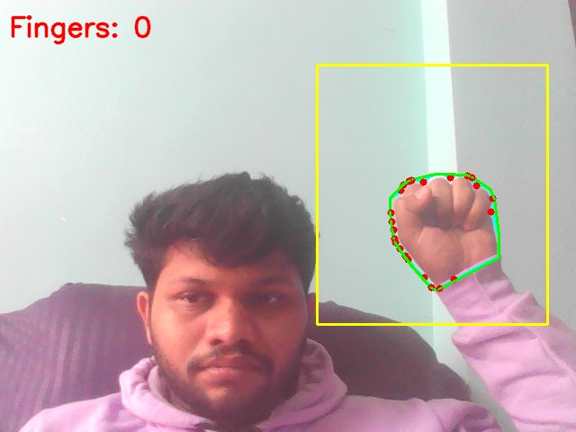 |
| **2 Fingers** | 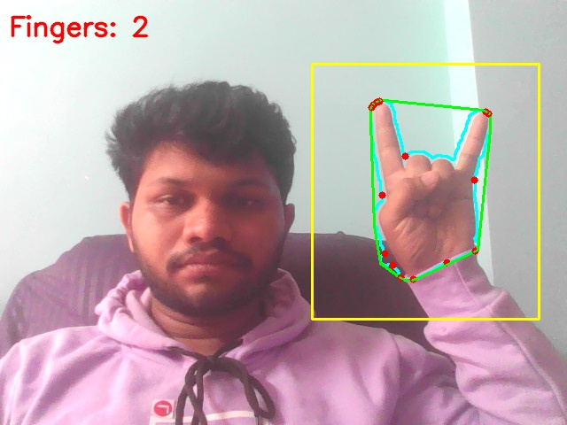 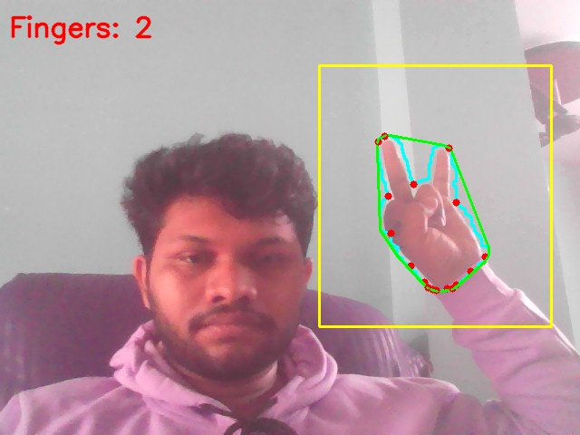 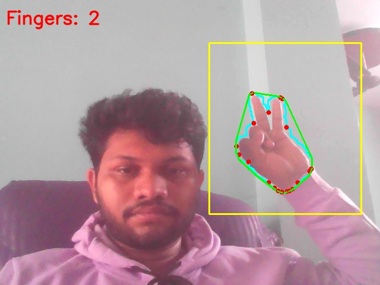 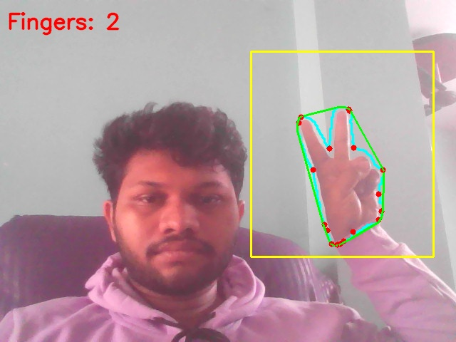 |
| **3 Fingers** | 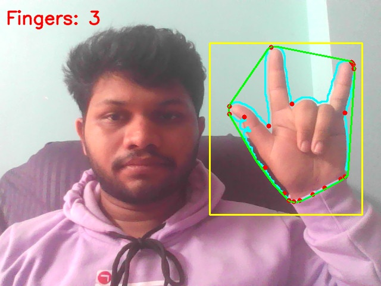 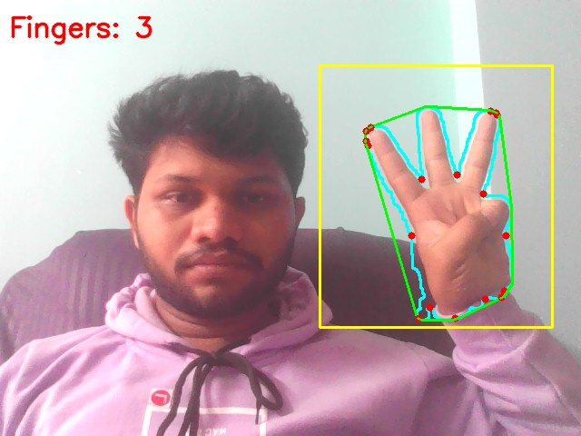 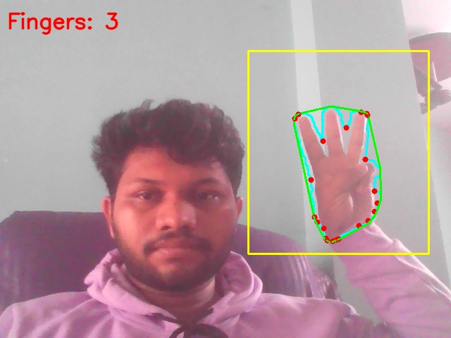 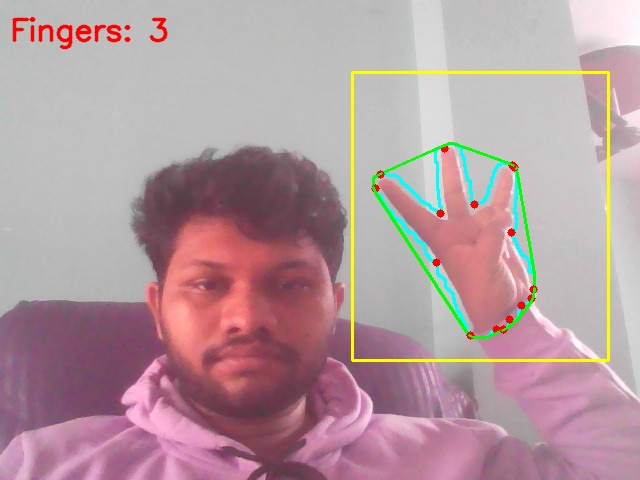 |
| **4 Fingers** | 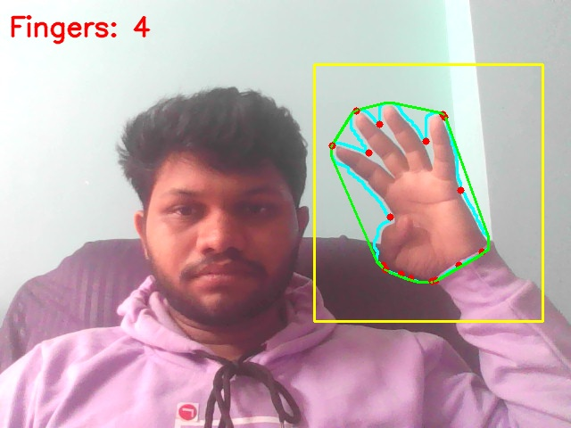  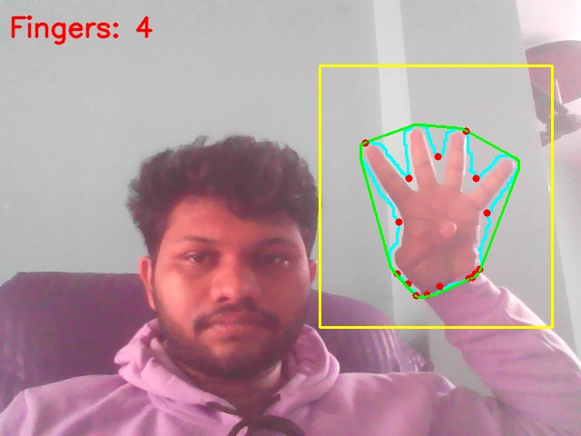 |
| **5 Fingers** | 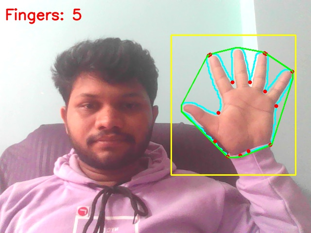 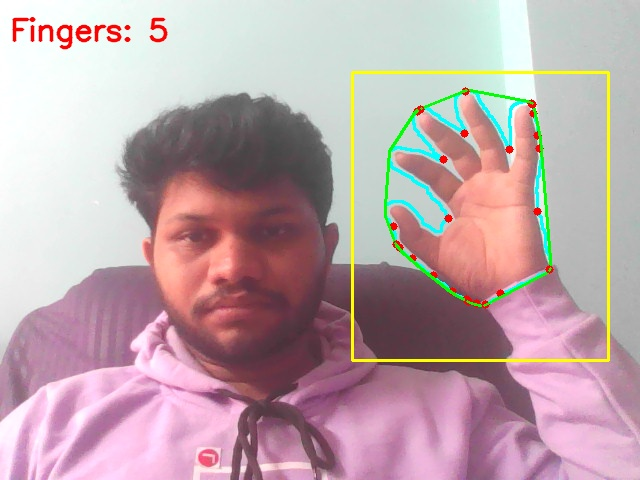  |

---

## ⚠️ Limitations

This classical CV method is intentionally simple, so it has weaknesses:

- Highly sensitive to **lighting conditions**
- Skin tone variations affect segmentation
- Complex or cluttered background inside ROI breaks masking
- Shadows, highlights, reflections can cause false contours
- Extreme hand rotations confuse convexity defect logic

These limitations are **the reason modern deep networks exist**.

---

## 🧠 Why This Project Matters

This repo teaches the fundamentals behind early computer vision gesture systems:

### Useful Applications
- Gesture-based UI/UX  
- Human–Computer Interaction (HCI)  
- Simple robot teleoperation  
- AR/VR gesture input  
- Basic HRI (Human–Robot Interaction)  
- Educational CV experiments  

### What You Learn
✔ How geometric CV pipelines work  
✔ Why convex hulls + defects can detect fingers  
✔ Where classical CV breaks down  
✔ How traditional techniques evolved into deep-learning models  
✔ The importance of segmentation → contour → hull → defects  

This foundational understanding will make you far better at using modern tools like:

- **MediaPipe Hands**
- **YOLO-based hand detection**
- **Deep hand pose estimation models**
- **Gesture recognition networks**

You now understand the *entire classical pipeline*, end-to-end.
